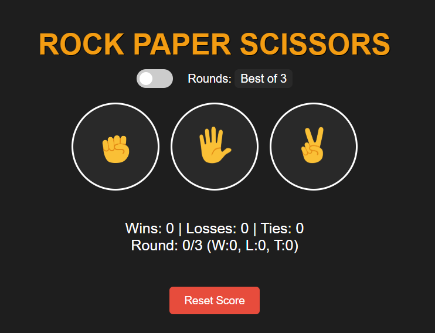

# 🎮 Rock Paper Scissors Game

A clean, fully functional, and interactive **Rock Paper Scissors** game built **from scratch by [Aizen4rdy](https://github.com/Aizen4rdy)** using `HTML`, `CSS`, and `JavaScript`.

This project includes:

- 🎚️ Match-round selection (Best of 3 / Best of 5)
- 🌗 Light/Dark theme toggle
- 🔊 Sound effects
- 🧠 Accurate match resolution (tie logic excluded from win condition)
- 🗃️ Persistent score tracking via `localStorage`
- 📱 Mobile responsiveness
- ✨ Smooth UI, transitions, and hover animations

---

## 🖼️ Screenshot



---

## ✅ Features

- 🌗 **Light/Dark Theme Toggle**
- 🎮 **Match Modes**: Best of 3 or 5
- 🔊 **Sound Effects**: Click, Win, Lose, Tie, Reset
- 🧠 **Accurate Match Logic** (Tie doesn't affect win condition)
- 💾 **Persistent Score** with `localStorage`
- 💻 **Responsive Design** with CSS media queries
- 🔁 **Reset Score Button**

---

## 📂 Folder Structure

rock-paper-scissors/
├── index.html
├── styles/
│ └── style.css
├── scripts/
│ └── script.js
├── images/
│ ├── rock.png
│ ├── paper.png
│ ├── scissors.png
│ └── screenshot.png
└── sounds/
├── click.mp3
├── win.mp3
├── lose.mp3
├── tie.mp3
└── reset.mp3
---
## 🚀 How to Run

1. **Clone the repository:**

```bash
git clone https://github.com/Aizen4rdy/rock-paper-scissors.git
